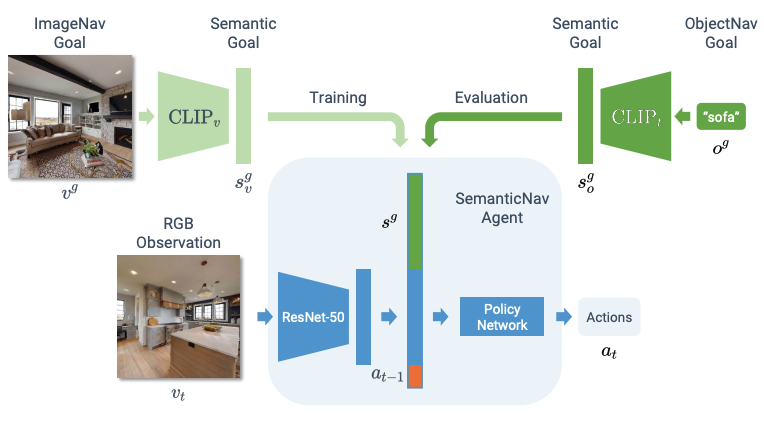

# ZSON: Zero-Shot Object-Goal Navigation using Multimodal Goal Embeddings

This is a PyTorch implementation of the NeurIPS-22 paper: https://arxiv.org/abs/2206.12403
Arjun Majumdar*, Gunjan Aggarwal*, Bhavika Devnani, Judy Hoffman and Dhruv Batra
Georgia Institute of Technology, Meta AI

## Details

We present a scalable approach for learning open-world object-goal navigation (ObjectNav) – the task of asking a virtual robot (agent) to find any instance of an object in an unexplored environment (e.g., “find a sink”). Our approach is entirely zero-shot – i.e., it does not require ObjectNav rewards or demonstrations of any kind.

<p align="center">
  

  <p align="center"><i>Model Architecture for ZSON. </i></p>
</p>

## Installation
All the required data can be downloaded from [here](https://huggingface.co/gunjan050/ZSON/tree/main).

1. Create a conda environment:
   ```
   conda create -n zson python=3.7 cmake=3.14.0
   ```
   ```
   conda activate zson
   ```

1. Install [pytorch](https://pytorch.org/) version `1.10.2`:
   ```
   conda install pytorch==1.10.2 torchvision==0.11.3 cudatoolkit=11.3 -c pytorch -c conda-forge
   ```

1. Install habitat-sim:
   ```
   conda install habitat-sim-challenge-2022 headless -c conda-forge -c aihabitat
   ```

1. Install habitat-lab:
   ```
   git clone --branch challenge-2022 https://github.com/facebookresearch/habitat-lab.git habitat-lab-challenge-2022
   ```
   ```
   cd habitat-lab-challenge-2022
   ```
   ```
   pip install -r requirements.txt
   ```
   ```
   python setup.py develop --all # install habitat and habitat_baselines
   ```
   ```
   cd ..
   ```


### Download and Install zson:
1. Setup steps
   ```
   git clone git@github.com:gunagg/zson.git
   ```
   ```
   cd zson
   ```
   ```
   pip install -r requirements.txt
   ```
   ```
   python setup.py develop
   ```

1. Follow the instructions [here](https://github.com/facebookresearch/habitat-sim/blob/main/DATASETS.md) to set up the `data/scene_datasets/` directory.

1. Download the HM3D ImageNav training dataset:

   ```
   wget https://huggingface.co/gunjan050/ZSON/resolve/main/imagenav_hm3d.zip
   ```
   ```
   unzip imagenav_hm3d.zip
   ```
   ```
   rm imagenav_hm3d.zip  # clean-up
   ```


1. Download the MP3D objectnav dataset.
   ```
   wget https://dl.fbaipublicfiles.com/habitat/data/datasets/objectnav/m3d/v1/objectnav_mp3d_v1.zip
   ```
   ```
   mkdir -p data/datasets/objectnav/mp3d/v1
   ```
   ```
   unzip objectnav_mp3d_v1.zip -d data/datasets/objectnav/mp3d/v1
   ```
   ```
   rm objectnav_mp3d_v1.zip  # clean-up
   ```


1. Download the HM3D objectnav dataset.
   ```
   wget https://dl.fbaipublicfiles.com/habitat/data/datasets/objectnav/hm3d/v1/objectnav_hm3d_v1.zip
   ```
   ```
   unzip objectnav_hm3d_v1.zip -d data/datasets/objectnav/
   ```
   ```
   rm objectnav_hm3d_v1.zip  # clean-up
   ```

1. To train policies using OVRL pretrained RGB encoder, download the model weights from [here](https://huggingface.co/gunjan050/ZSON/resolve/main/omnidata_DINO_02.pth) and move to `data/models/`.
More details on the encoder can be found [here](https://arxiv.org/pdf/2204.13226.pdf).

1. Setup `data/goal_datasets` using the script `tools/extract-goal-features.py`. This caches CLIP goal embeddings for faster training. 

   Your directory structure should now look like this:
   ```
   .
   +-- habitat-lab-v0.2.1/
   |   ...
   +-- zson/
   |   +-- data/
   |   |   +-- datasets/
   |   |   |   +-- objectnav/
   |   |   |   +-- imagenav/
   |   |   +-- scene_datasets/
   |   |   |   +-- hm3d/
   |   |   |   +-- mp3d/
   |   |   +-- goal_datasets/
   |   |   |   +-- imagenav/
   |   |   |   |   +-- hm3d/
   |   |   +-- models/
   |   +-- zson/
   |   ...
   ```

## Usage

### ZSON configuration A ImageNav Training

  ```
  sbatch scripts/imagenav-v1-hm3d-ovrl-rn50.sh
  ```
### ZSON configuration B ImageNav Training

  ```
  sbatch scripts/imagenav-v2-hm3d-ovrl-rn50.sh
  ```

### ObjectNav Evaluation

To evaluate a checkpoint trained using ZSON checkpoint use the following command:

  ```
  sbatch scripts/objnav-eval-$DESIRED-CONFIGURATION$-$DATASET$.sh
  ```

## Citation

If you use this code in your research, please consider citing:
```
@inproceedings{majumdar2022zson,
  title={ZSON: Zero-Shot Object-Goal Navigation using Multimodal Goal Embeddings},
  author={Majumdar, Arjun and Aggarwal, Gunjan and Devnani, Bhavika and Hoffman, Judy and Batra, Dhruv},
  booktitle={Neural Information Processing Systems (NeurIPS)},
  year={2022}
}
```
